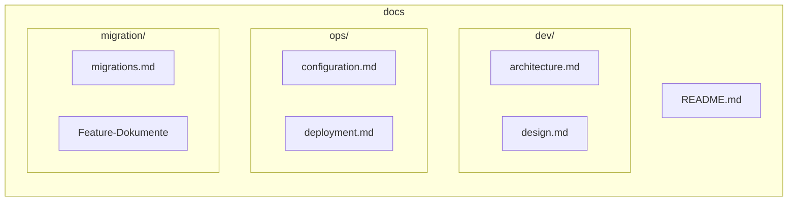
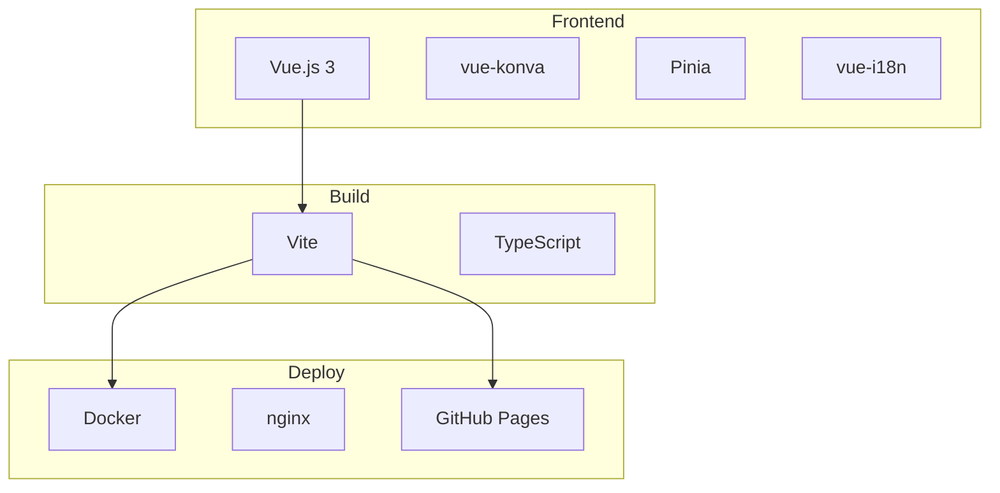

# WoPeD Next - Dokumentation

## Übersicht

WoPeD Next ist eine moderne Web-Anwendung zur Modellierung und Analyse von Petri-Netzen und Workflow-Prozessen. Migriert von der ursprünglichen Java Swing Desktop-Anwendung zu Vue.js 3.



## Features

### Editor
| Feature | Beschreibung |
|---------|--------------|
| **Petri-Netz Editor** | Places, Transitions, Arcs mit Gewichtung |
| **Workflow Operatoren** | AND/XOR Split/Join, kombinierte Operatoren |
| **Subprozesse** | Hierarchische Netze mit Drill-down Navigation |
| **Visualisierung** | Grid, Snap-to-Grid, Auto-Layout, Fit-to-View |

### Simulation & Analyse
| Feature | Beschreibung |
|---------|--------------|
| **Token Game** | Animierte Simulation mit Konfliktauflösung |
| **Quantitative Simulation** | Zeit-basierte Simulation mit Ressourcen |
| **Qualitative Analyse** | Strukturanalyse, Soundness-Prüfung |
| **Process Metrics** | Komplexitäts- und Strukturmetriken |

### Datei & Export
| Feature | Beschreibung |
|---------|--------------|
| **PNML Import/Export** | Standard Petri-Net Format |
| **JSON Import/Export** | Eigenes Format mit voller Unterstützung |
| **Bild-Export** | SVG und PNG Export |
| **Templates** | 10 lehrreiche Beispiel-Netze |

### UI/UX
| Feature | Beschreibung |
|---------|--------------|
| **Themes** | Dark/Light Mode mit System-Erkennung |
| **Sprachen** | Deutsch und Englisch |
| **Responsive** | Kollabierbare Panels, adaptive Toolbar |

## Inhaltsverzeichnis

### Development (`dev/`)
- [Architektur](dev/architecture.md) - Systemarchitektur, Tech Stack, Patterns
- [Design](dev/design.md) - UI/UX Design-Richtlinien

### Operations (`ops/`)
- [Konfiguration](ops/configuration.md) - Umgebungsvariablen und Settings
- [Deployment](ops/deployment.md) - Build und Deployment-Prozesse

### Migration (`migration/`)
- [Migrationen](migration/migrations.md) - Changelog und Implementierungsstatus
- [Feature-Dokumente](migration/00-migration-overview.md) - Detaillierte Feature-Spezifikationen

## Quick Start

```bash
# Installation
npm install

# Entwicklungsserver
npm run dev

# Produktion Build
npm run build

# Docker
docker-compose up
```

## Quick Links

| Bereich | Beschreibung |
|---------|--------------|
| [Dev Setup](dev/architecture.md#entwicklungsumgebung) | Lokale Entwicklung starten |
| [Docker Deploy](ops/deployment.md#docker) | Container-Deployment |
| [Changelog](migration/migrations.md) | Versionsänderungen |
| [Feature Status](migration/migrations.md#implementierungsstatus) | Implementierungsstand |

## Technologie-Stack


