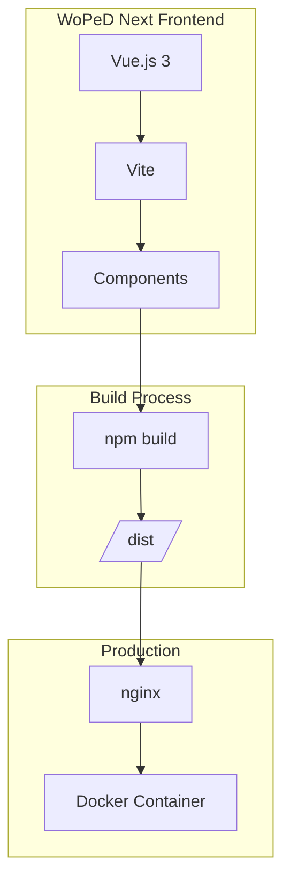
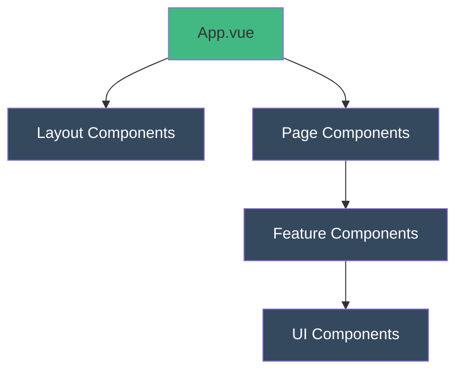

# Architektur

## Systemübersicht



## Komponentenstruktur



## Verzeichnisstruktur

```
src/
├── assets/          # Statische Assets (Bilder, Fonts)
├── components/      # Wiederverwendbare Komponenten
├── composables/     # Vue Composition Functions
├── i18n/            # Internationalisierung (vue-i18n)
│   ├── index.ts     # i18n Konfiguration
│   └── locales/     # Sprachdateien
│       ├── en.ts    # Englisch
│       └── de.ts    # Deutsch
├── services/        # Business Logic Services
├── stores/          # Pinia Stores (State Management)
├── types/           # TypeScript Typen
├── utils/           # Hilfsfunktionen
├── App.vue          # Root-Komponente
└── main.js          # Einstiegspunkt
```

## Entwicklungsumgebung

### Voraussetzungen
- Node.js 22+
- npm 10+

### Setup

```bash
npm install
npm run dev
```

## Tech Stack

| Technologie | Version | Zweck |
|-------------|---------|-------|
| Vue.js | 3.x | Frontend Framework |
| Vite | 6.x | Build Tool |
| Pinia | 3.x | State Management |
| vue-i18n | 11.x | Internationalisierung |
| vue-konva | 3.x | Canvas-Rendering (Petri-Netz) |
| nginx | alpine | Webserver (Produktion) |

## Internationalisierung (i18n)

Die Anwendung unterstützt mehrere Sprachen über `vue-i18n`:

- **Konfiguration**: `src/i18n/index.ts`
- **Sprachdateien**: `src/i18n/locales/`
- **Unterstützte Sprachen**: Englisch (en), Deutsch (de)

### Verwendung in Komponenten

```vue
<script setup>
import { useI18n } from 'vue-i18n'
const { t } = useI18n()
</script>

<template>
  <span>{{ $t('key.path') }}</span>
</template>
```

### Neue Übersetzungen hinzufügen

1. Key in `src/i18n/locales/en.ts` hinzufügen
2. Übersetzung in `src/i18n/locales/de.ts` hinzufügen
3. In Komponente mit `$t('key.path')` verwenden
