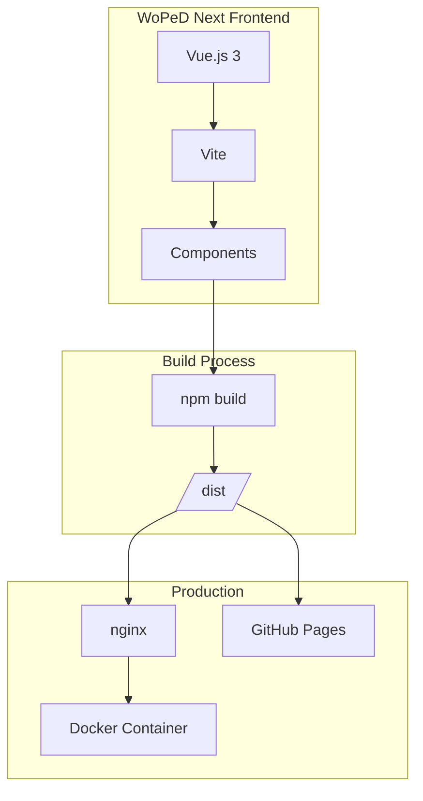
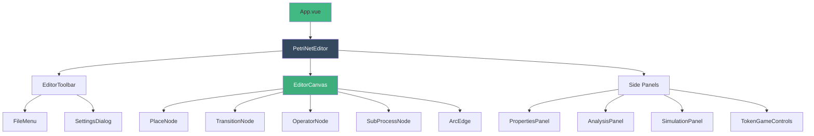
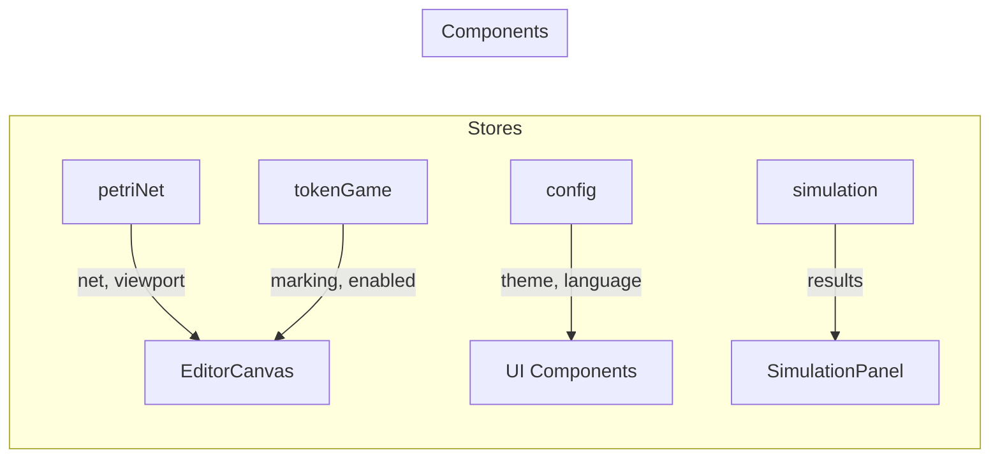

# Architektur

## Systemübersicht



## Komponentenstruktur



## Verzeichnisstruktur

```
src/
├── assets/              # Statische Assets
├── components/
│   ├── analysis/        # Analyse-Komponenten
│   │   ├── AnalysisPanel.vue
│   │   └── MetricsSection.vue
│   ├── canvas/          # Konva Canvas-Elemente
│   │   ├── PlaceNode.vue
│   │   ├── TransitionNode.vue
│   │   ├── OperatorNode.vue
│   │   ├── SubProcessNode.vue
│   │   ├── ArcEdge.vue
│   │   └── TokenAnimation.vue
│   ├── editor/          # Editor-Hauptkomponenten
│   │   ├── PetriNetEditor.vue
│   │   ├── EditorCanvas.vue
│   │   ├── EditorToolbar.vue
│   │   ├── ViewToolbar.vue
│   │   ├── PropertiesPanel.vue
│   │   ├── BreadcrumbNav.vue
│   │   └── SubprocessPreview.vue
│   ├── file/            # Datei-Operationen
│   │   └── FileMenu.vue
│   ├── settings/        # Einstellungen
│   │   └── SettingsDialog.vue
│   ├── simulation/      # Quantitative Simulation
│   │   ├── SimulationPanel.vue
│   │   ├── SimulationConfig.vue
│   │   ├── SimulationResults.vue
│   │   ├── TimeModelConfig.vue
│   │   ├── ResourceConfig.vue
│   │   └── BottleneckAnalysis.vue
│   ├── token-game/      # Token Game
│   │   ├── TokenGameControls.vue
│   │   ├── TokenGameStats.vue
│   │   └── ConflictDialog.vue
│   └── triggers/        # Trigger-Editor
│       └── TriggerEditor.vue
├── composables/         # Vue Composition Functions
│   └── useViewport.ts
├── i18n/                # Internationalisierung
│   ├── index.ts
│   └── locales/
│       ├── en.ts
│       └── de.ts
├── services/            # Business Logic
│   ├── analysis/        # Analyse-Services
│   │   ├── index.ts
│   │   └── metricsCalculator.ts
│   ├── file/            # File-Services
│   │   ├── fileService.ts
│   │   ├── pnmlParser.ts
│   │   ├── pnmlWriter.ts
│   │   ├── jsonParser.ts
│   │   └── imageExporter.ts
│   ├── simulation/      # Simulation-Services
│   │   ├── SimulationEngine.ts
│   │   └── XESExporter.ts
│   └── templates/       # Template-Service
│       └── petriNetTemplates.ts
├── stores/              # Pinia Stores
│   ├── petriNet.ts      # Haupt-Store für Petri-Netz
│   ├── config.ts        # Konfiguration & Einstellungen
│   ├── tokenGame.ts     # Token Game State
│   └── simulation.ts    # Simulation State
├── types/               # TypeScript Typen
│   ├── petri-net.ts     # Petri-Netz Typen
│   ├── config.ts        # Config Typen
│   ├── simulation.ts    # Simulation Typen
│   ├── metrics.ts       # Metriken Typen
│   ├── triggers.ts      # Trigger Typen
│   └── file-formats.ts  # Dateiformat Typen
├── utils/               # Hilfsfunktionen
│   ├── geometry.ts      # Geometrie-Berechnungen
│   ├── routing.ts       # Arc-Routing
│   ├── layout.ts        # Auto-Layout Algorithmen
│   └── random.ts        # Zufallsgeneratoren
├── App.vue
└── main.js
```

## Tech Stack

| Technologie | Version | Zweck |
|-------------|---------|-------|
| Vue.js | 3.x | Frontend Framework |
| Vite | 6.x | Build Tool |
| Pinia | 3.x | State Management |
| vue-i18n | 11.x | Internationalisierung |
| vue-konva | 3.x | Canvas-Rendering (Petri-Netz) |
| nanoid | 5.x | Eindeutige ID-Generierung |
| nginx | alpine | Webserver (Produktion) |

## State Management (Pinia)

### Store-Übersicht



### Reaktivitätsmuster für verschachtelte Objekte

Bei verschachtelten State-Objekten (z.B. `config.editor.showGrid`) können Reaktivitätsprobleme auftreten. Empfohlene Lösungen:

```typescript
// Store: Getters für verschachtelte Properties
getters: {
  showGrid(): boolean {
    return this.editor.showGrid
  }
}

// Store: Explizite Toggle-Actions
actions: {
  toggleShowGrid() {
    this.editor.showGrid = !this.editor.showGrid
    this.save()
  }
}
```

```typescript
// Component: $state explizit referenzieren
const showGrid = computed(() => configStore.$state.editor.showGrid)
```

### Vue-Konva Integration

Bei vue-konva `v-if` auf Layern vermeiden - stattdessen Konva's native `visible` Property:

```vue
<v-layer :config="gridLayerConfig">

<script setup>
const gridLayerConfig = computed(() => ({
  visible: showGrid.value
}))
</script>
```

## Entwicklungsumgebung

### Voraussetzungen
- Node.js 22+
- npm 10+

### Setup

```bash
npm install
npm run dev
```

### Build

```bash
# Produktion Build
npm run build

# Preview
npm run preview
```

### Docker

```bash
docker-compose up --build
```

## Internationalisierung (i18n)

Die Anwendung unterstützt mehrere Sprachen über `vue-i18n`:

- **Konfiguration**: `src/i18n/index.ts`
- **Sprachdateien**: `src/i18n/locales/`
- **Unterstützte Sprachen**: Englisch (en), Deutsch (de)

### Verwendung in Komponenten

```vue
<script setup>
import { useI18n } from 'vue-i18n'
const { t } = useI18n()
</script>

<template>
  <span>{{ $t('key.path') }}</span>
</template>
```

### Neue Übersetzungen hinzufügen

1. Key in `src/i18n/locales/en.ts` hinzufügen
2. Übersetzung in `src/i18n/locales/de.ts` hinzufügen
3. In Komponente mit `$t('key.path')` verwenden

## Deployment

### GitHub Pages

Das Projekt ist auf GitHub Pages deployed:
- **URL**: https://taminofischer.github.io/woped-next/
- **CI/CD**: GitHub Actions

### Docker

```bash
# Build und Start
docker-compose up --build

# Nur Build
docker build -t woped-next .

# Container starten
docker run -p 80:80 woped-next
```
