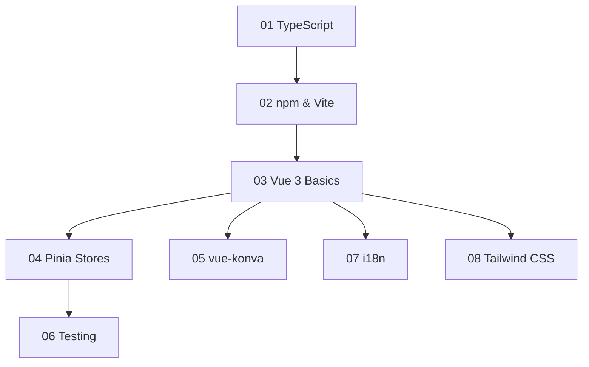

# Learning Guide — WoPeD Next

## Welcome

This guide helps you get started with the technologies used in WoPeD Next. Each module covers a specific topic with explanations, real examples from the project, and hands-on exercises.

You don't need to complete every module — pick what's relevant for your current task. However, the recommended learning path below builds knowledge progressively.

## Prerequisites

- Basic programming knowledge (variables, functions, loops, conditionals)
- A code editor (VS Code / Cursor recommended)
- Node.js 22+ installed ([download](https://nodejs.org/))
- Git basics (clone, commit, push)

## Learning Path



| # | Module | Duration | Difficulty | What you'll learn |
|---|--------|----------|------------|-------------------|
| 01 | [TypeScript](01-typescript.md) | 2-3h | Beginner | Types, interfaces, generics, enums |
| 02 | [npm & Vite](02-npm-and-vite.md) | 1-2h | Beginner | Package management, project structure, dev server |
| 03 | [Vue 3 Basics](03-vue3-basics.md) | 3-4h | Beginner | Composition API, reactivity, components, props, emits |
| 04 | [Pinia Stores](04-pinia-stores.md) | 2-3h | Intermediate | State management, actions, getters, store composition |
| 05 | [vue-konva](05-vue-konva.md) | 2-3h | Intermediate | Canvas rendering, shapes, layers, events, drag & drop |
| 06 | [Testing](06-testing.md) | 2-3h | Intermediate | Vitest, unit tests, component tests, mocking |
| 07 | [i18n](07-i18n.md) | 1h | Beginner | Internationalization, translation keys, locale switching |
| 08 | [Tailwind CSS](08-tailwind-css.md) | 1-2h | Beginner | Utility-first CSS, responsive design, dark mode |

## How to Use This Guide

Each module follows the same structure:

1. **Concepts** — Brief explanation of the technology and why we use it
2. **Project Examples** — Real code from WoPeD Next showing the concepts in action
3. **Exercises** — Hands-on tasks, starting simple and increasing in difficulty
4. **Resources** — Links to official docs and tutorials for deeper learning

### Exercise Difficulty Levels

| Level | Meaning |
|-------|---------|
| **Starter** | Follow the instructions step by step — minimal prior knowledge needed |
| **Standard** | Requires understanding of the module concepts — some thinking needed |
| **Challenge** | Open-ended problems that require combining concepts — good preparation for real tasks |

## Getting Started

```bash
# 1. Clone the repository
git clone https://github.com/TaminoFischer/woped-next.git
cd woped-next

# 2. Install dependencies
npm install

# 3. Start the development server
npm run dev

# 4. Open in browser
# http://localhost:5173
```

Now open [01-typescript.md](01-typescript.md) and start learning.

## Tech Stack Overview

| Technology | Purpose | Version |
|------------|---------|---------|
| [Vue 3](https://vuejs.org/) | UI framework | 3.5 |
| [TypeScript](https://www.typescriptlang.org/) | Type-safe JavaScript | 5.9 |
| [Vite](https://vite.dev/) | Build tool & dev server | 7.2 |
| [Pinia](https://pinia.vuejs.org/) | State management | 3.0 |
| [vue-konva](https://github.com/konvajs/vue-konva) | Canvas rendering (Petri net editor) | 3.3 |
| [Tailwind CSS](https://tailwindcss.com/) | Utility-first CSS | 4.1 |
| [Vitest](https://vitest.dev/) | Testing framework | 4.0 |
| [vue-i18n](https://vue-i18n.intlify.dev/) | Internationalization (DE/EN) | 11.2 |
