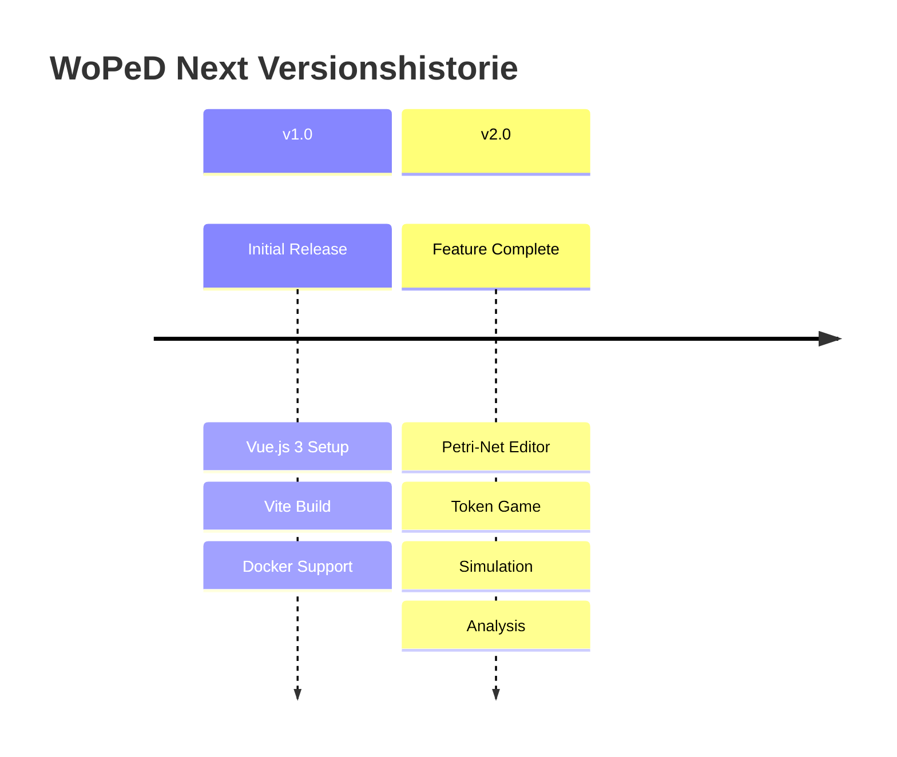
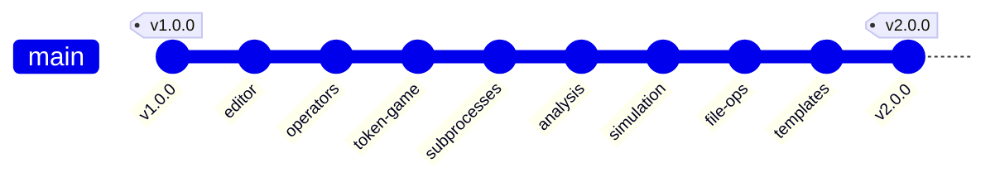
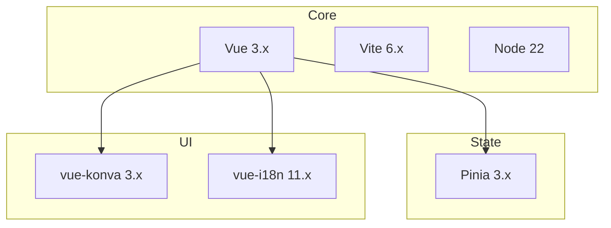

# Migrationen

## Übersicht

## Implementierungsstatus

| Feature | Status | Beschreibung |
|---------|--------|--------------|
| Petri-Netz Editor | ✅ Fertig | Places, Transitions, Arcs, Labels |
| Workflow Operatoren | ✅ Fertig | AND/XOR Split/Join, kombinierte Operatoren |
| Subprozesse | ✅ Fertig | Hierarchische Netze, Drill-down, Breadcrumb |
| Token Game | ✅ Fertig | Animation, Konfliktauflösung, Statistiken |
| Visualisierung | ✅ Fertig | Grid, Snap, Auto-Layout, Fit-to-View |
| Qualitative Analyse | ✅ Fertig | Strukturanalyse, Soundness-Prüfung |
| Quantitative Simulation | ✅ Fertig | Zeit-Delays, Ressourcen, Bottleneck-Analyse |
| Process Metrics | ✅ Fertig | Komplexitätsmetriken, Strukturanalyse |
| File Operations | ✅ Fertig | PNML/JSON Import/Export mit Subprozessen |
| Konfiguration | ✅ Fertig | Dark/Light Mode, Sprache, Editor-Settings |
| Templates | ✅ Fertig | Lehrreiche Beispiel-Netze |
| NLP Integration | 🔜 Geplant | Natürliche Sprachverarbeitung |
| Triggers & Resources | ⚠️ Teilweise | Basis-Typen definiert |

## Changelog

### v2.0.0 (Feature Complete)

#### Neue Features

**Editor & Visualisierung**
- Vollständiger Petri-Netz Editor mit Konva.js Canvas
- 8 Workflow-Operatoren (AND/XOR Split/Join, kombiniert)
- Hierarchische Subprozesse mit Drill-down Navigation
- Breadcrumb-Navigation für Subprozesse
- Grid-Anzeige mit Snap-to-Grid Funktion
- Auto-Layout (hierarchisch, force-directed, grid)
- Automatisches Fit-to-View beim Laden
- Kollabierbare Seitenpanels

**Token Game**
- Animierte Token-Bewegung
- Drei Konfliktauflösungsmodi: Manual, Random, First
- Token Game Statistiken (Schritte, Konflikte, Deadlocks)
- Subprozess-Integration (Step Into/Out)

**Simulation & Analyse**
- Quantitative Simulation mit diskreter Ereignissimulation
- Zeit-Modelle (konstant, uniform, exponential, normal)
- Ressourcen-Management und -Zuweisung
- Bottleneck-Analyse mit Empfehlungen
- XES-Export für Process Mining
- Qualitative Analyse (Struktur, Soundness)
- Process Metrics (Komplexität, Struktur)

**File Operations**
- PNML Import/Export (mit Subprozess-Unterstützung)
- JSON Import/Export (mit Subprozess-Unterstützung)
- SVG/PNG Export
- Template-Bibliothek mit 10 Beispiel-Netzen

**UI/UX**
- Dark/Light Mode mit System-Erkennung
- Deutsch/Englisch Internationalisierung
- Einstellungs-Dialog mit Persistierung
- Responsive Toolbar mit Icon-Tabs

#### Dateien

| Bereich | Neue Dateien |
|---------|--------------|
| Components | `editor/`, `canvas/`, `token-game/`, `simulation/`, `analysis/` |
| Stores | `petriNet.ts`, `config.ts`, `tokenGame.ts`, `simulation.ts` |
| Services | `file/`, `analysis/`, `simulation/`, `templates/` |
| Types | `petri-net.ts`, `config.ts`, `simulation.ts`, `metrics.ts` |

---

### v1.0.0 (Initial Release)

#### Features
- Vue.js 3 mit Vite initialisiert
- Docker-Unterstützung mit Multi-Stage Build
- nginx als Produktions-Webserver
- Cursor Rules für Entwicklung
- Basis-Dokumentation

---

## Abhängigkeiten

| Paket | Version | Zweck |
|-------|---------|-------|
| vue | 3.x | Frontend Framework |
| vite | 6.x | Build Tool |
| pinia | 3.x | State Management |
| vue-konva | 3.x | Canvas Rendering |
| vue-i18n | 11.x | Internationalisierung |
| nanoid | 5.x | ID-Generierung |
